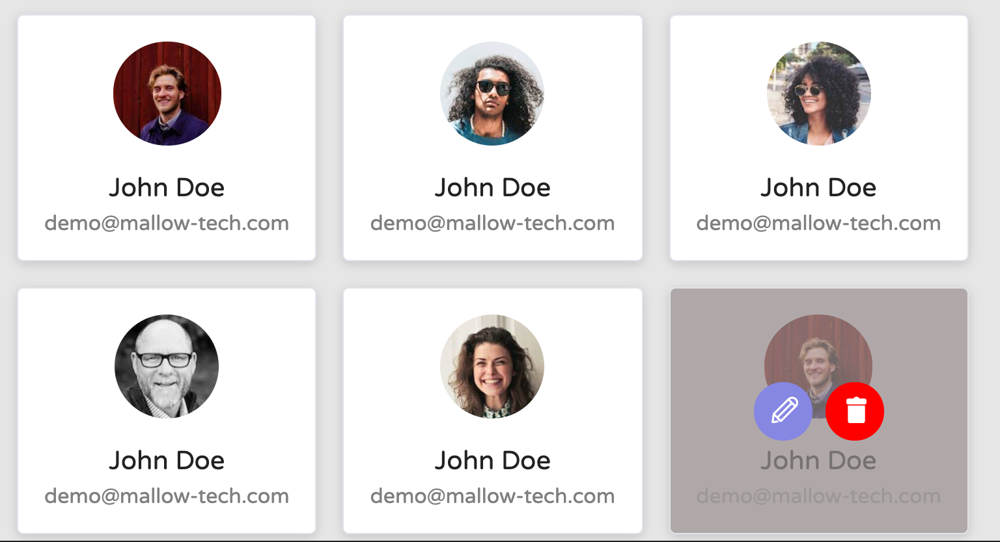

# React Developer Recruitment Class Based Task

### Quick Set Up 

`Clone this repository`

`yarn install`

`yarn start`

### Login Credential

Username: `eve.holt@reqres.in`
Password: `cityslicka`

### Mock API docs

[REQ | RES](https://reqres.in/)

### Tasks

1. Need to show logged username and email in the header.
2. Implement logout.
3. Profile image in the user's table needs to be aligned.
4. Align the `search box` and `create user button` right side above the table.
5. Align the `pagination buttons` bottom right in the table.
6. Add a button loader to create the user and close the drawer on API success. (Follow this for Edit user)
7. Show the created user in the first row of the user's table on API success.
8. Remove the user from the table, If deleted and get a confirmation from the user in a modal before deleting.
9. ReUse CreateUpdateDrawer component to Edit user details.
10. Implement client-side search for users table.
11. Show user details in `<UserDetails/>`, Navigate to detail component on clicking the email in the user's table and Card View. (Use single User API).
12. Display the users in card view also with edit and delete.
13. Restrict user logout on app refresh.

### Users Card View UI

Note: Don't use any CSS Frameworks, Use only Custom CSS.

### Must-have

1. Loaders when you wait for the data.
2. Validation on forms.
3. Following EsLint rules.
4. Good UX.
   
### What will we be paying attention to

1. How you split code for components.
2. How you communicate with redux.
3. Reusability of the components.
4. Code repetitions and reusability.
5. How and where you put your business logic.
6. Code optimization and the solution's performance.
7. Working in accordance with good practices in general.
8. How you communicate with API.
9. Handling unexpected errors or potential exceptions.
